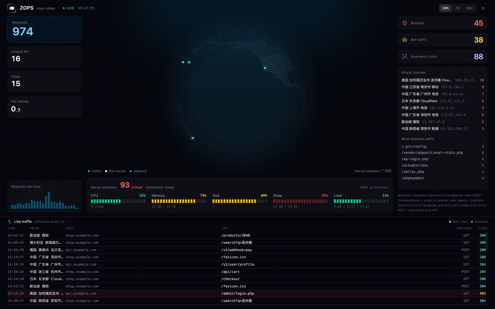
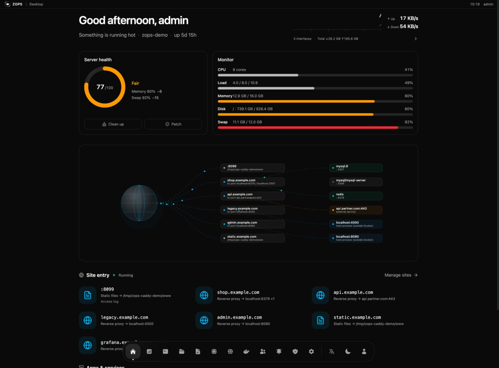
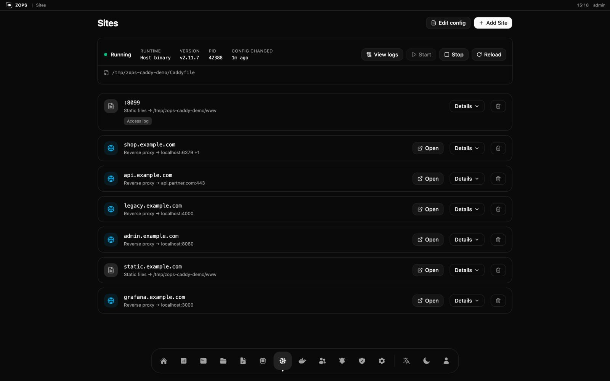
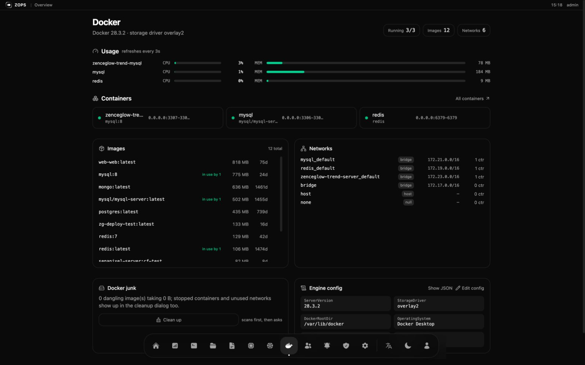
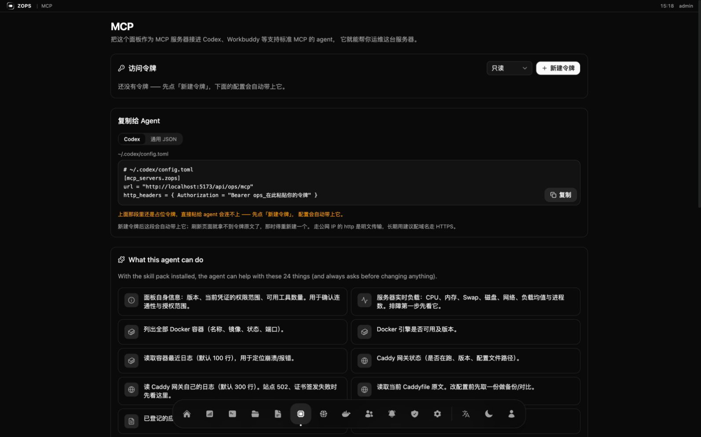

# ZOPS

**A server ops panel that AI agents can actually operate.** One Rust binary, one
SQLite file, no external services — a desktop-like control panel for a single
Linux box, plus a built-in **MCP server** and **skill pack** so Codex, Workbuddy
or any MCP-capable agent can watch and fix that box under your rules.

**Website:** https://ops.zenceglow.com · **Source:** https://github.com/zenceglow/zops

## Install

On the server, as root:

```bash
curl -fsSL https://cdn.zenceglow.com/app/ops/install.sh | bash
```

Six short prompts, every one with a default — pressing Enter all the way through
gives you a working panel:

| Step | Choice |
|---|---|
| 1. Language | English (default) / 中文 |
| 2. Existing install | detected automatically; tells you install vs. upgrade |
| 3. Port | 1) random 2) enter one |
| 4. Domain | 1) skip (use `IP:port`) 2) enter one (written into Caddy and reloaded) |
| 5. Username | 1) random 2) enter one |
| 6. Password | asked only if you entered a username; 1) random 2) enter one (≥ 6 chars) |

It downloads the binary, writes a systemd unit, starts the service, creates the
admin account and prints the panel URL, credentials and MCP endpoint.

**Same command upgrades.** The installer keeps your port, domain, data directory
and accounts, backs up the database, then swaps the binary. The panel can also
upgrade itself — new versions pop a dialog with an **Update now** button that
downloads, verifies (size → ELF magic → actually runs `--version`), swaps
atomically, keeps a `.bak`, and restarts the service.

Non-interactive installs read the same values from the environment:

```bash
OPS_LANG=en OPS_PORT=5200 OPS_DOMAIN=ops.example.com \
OPS_USER=admin OPS_PASSWORD=secret bash install.sh
```

---



*Access analytics, fed by the Caddy access log: requests, cities, bots and
scanners, blocked probes, and a live traffic feed.*

## What you get

|  |  |
|---|---|
|  **Desktop** — greeting, health score, live pressure, and a request-path map that draws every domain to the container serving it |  **Sites** — visual entries next to the raw Caddyfile, validated before saving, versioned in SQLite |
|  **Docker** — per-container usage, images with sizes, networks, junk, and an editable engine config (registry mirrors) |  **MCP** — create a token, copy the config into your agent, and see exactly what it is allowed to do |

## Why not another panel

Panels like 宝塔 / 1Panel / Cockpit are **forms for humans**; agent support, when
it exists, is a bolt-on. ZOPS starts from the other end — the panel is the *only*
door, for you **and** for the agent. That is what makes it safe to let an agent
near production:

|  | Traditional panel | ZOPS |
|---|---|---|
| Primary user | a human clicking forms | a human **and** an agent |
| Agent access | SSH key / ad-hoc API | standard MCP endpoint + installable skill pack |
| What the agent can see | nothing | 24 typed tools (load, containers, ports, logs, Caddy…) |
| Destructive ops | whatever the shell allows | flagged tools, agent is told to confirm first |
| Blast radius of a bad edit | unclear | sites are marked blocks; config is validated before save |
| Audit | a log file | who / from where / what / result, in SQLite |
| Deploying an app | compose by hand | `ops_deploy_plan` → review → `ops_deploy_apply` |
| Footprint | PHP + nginx + daemons | 15 MB static binary + SQLite |

## Features

**Desktop** — a health score ring, live CPU / memory / disk / swap, and a request
path map from domain to container. Not a wall of tables.

**Server** — timezone, swap file, firewall, and patch management that detects the
distro (Ubuntu / Debian / CentOS / Rocky…) and folds outstanding security updates
into the health score. Cleanup scans first, shows you what it found, then asks.

**Docker** — containers (start / stop / restart / delete), images (size, in use
by, delete), networks, junk, and the engine config: edit `registry-mirrors` and
`insecure-registries` in a form, or the raw JSON. Validated, backed up, written
atomically, then Docker restarts.

**Caddy gateway** — every site is written between `# ZOPS:BEGIN/END` markers, so
edits and deletions touch one site instead of the whole file, and nothing is
saved until `caddy validate` passes. Config history lives in SQLite.

**Also** — SSH terminal, application log viewer, scheduled tasks, notification
channels (Feishu / DingTalk / WeCom / Slack / Discord / Telegram / webhook),
members with RBAC, an operation audit log, and in-panel self-update.

## Connect an agent

Open **MCP** in the panel, create a token (`read` or `write`) and copy the config:

```toml
# ~/.codex/config.toml
[mcp_servers.zops]
url = "https://ops.example.com/api/ops/mcp"
http_headers = { Authorization = "Bearer ops_xxxxxxxx" }
```

The same page gives you a one-liner that installs the **skill pack** into the
agent's skill directory — that is the difference between "the agent has 24 tools"
and "the agent knows what to do with them".

```text
ops_panel_info            ops_system_overview        ops_container_list
ops_container_status      ops_container_logs         ops_container_start
ops_container_stop        ops_container_restart      ops_gateway_status
ops_gateway_logs          ops_gateway_reload         ops_caddyfile_get
ops_caddyfile_put         ops_log_source_list        ops_log_tail
ops_port_list             ops_deploy_list            ops_deploy_plan
ops_deploy_apply          ops_automation_task_list   ops_automation_task_run
ops_member_list           ops_notify_channel_list    ops_notify_send
```

Tokens are hashed server-side and shown once. State-changing tools carry an
explicit "changes the server" flag, and the skill instructs the agent to get your
confirmation before calling them.

## Deploy your own apps

Give the agent a project directory and it will:

1. **Look at the machine first** — `ops_port_list` for a free port,
   `ops_deploy_list` to avoid name collisions, instead of guessing.
2. **Run a production check** — restart policy, log rotation, time zone, network,
   plaintext credentials. Missing items come back as `warn` or `block`.
3. **Ask only when it matters** — a missing log rotation policy is a warn; a
   hardcoded database password is a block.
4. **Write and start it** — generates the compose file, runs
   `docker compose up -d --build`, reports the port and URL.

You stop writing Docker configs by hand and still get the layout you would have
written yourself.

## Security model

- **One door.** Agents go through the panel, never the host. Every write is a
  typed tool call, not an arbitrary shell.
- **Scopes.** `read` tokens cannot call state-changing tools, and MCP
  `tools/list` filters by permission — the agent does not even see them.
- **Audit.** Every write, human or agent, records actor, kind, IP, method, path,
  status, a summary and a redacted body. Secrets are stripped before writing.
- **Validate before save.** Caddy config is validated in a temp file first, so a
  bad site can no longer take the whole gateway down.
- **Accounts.** Argon2 hashes, JWT sessions, role-based permissions. Locked out?
  `zenceglow-ops --reset-password <user> <new>` on the box.

## Develop

```bash
./dev.sh              # frontend :5173, backend :127.0.0.1:5200
cargo test            # backend tests
cd frontend && npx tsc --noEmit
```

Rust (axum + SQLite) and React + Vite + Tailwind, embedded into the binary with
`rust-embed` so production is a **single file**. See
[API-CONVENTIONS.md](./API-CONVENTIONS.md) for the response envelope and route
conventions.

## Keywords

AI agent server management · MCP server for DevOps · Codex skill · Workbuddy ·
agent operations tool · Agent 运维工具 · Docker panel · Caddy GUI ·
single-server ops · self-hosted panel · 宝塔替代 · 1Panel alternative ·
deploy your app from an agent

## License

[MIT](./LICENSE) © 2026 Zenceglow (广州境际之光科技有限公司) ·
developer@zenceglow.com · https://ops.zenceglow.com
