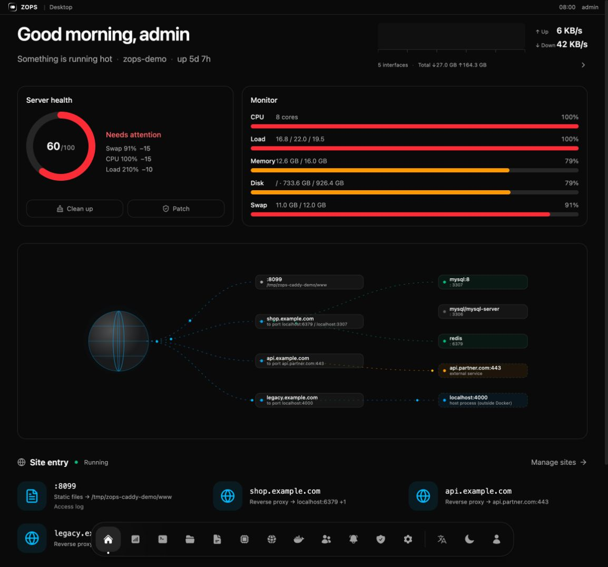
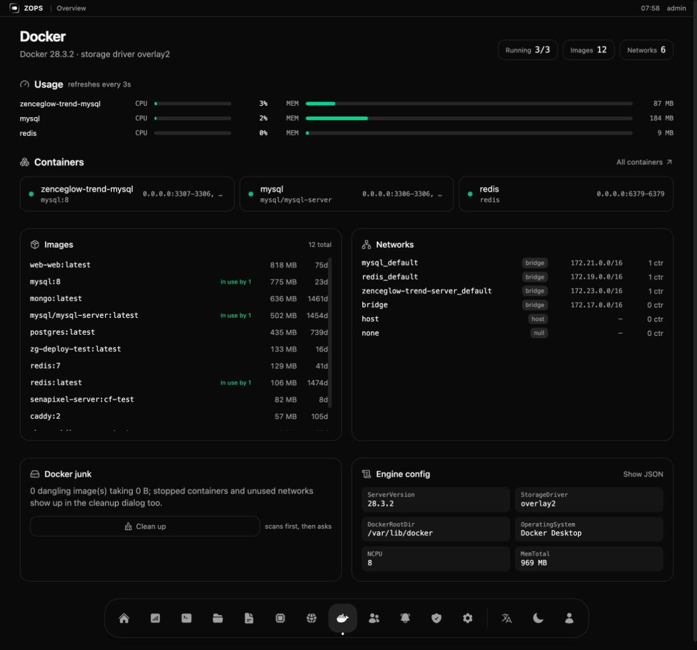
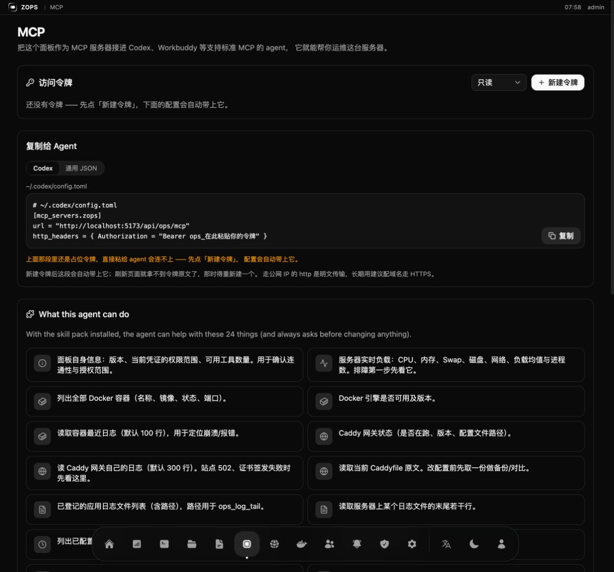

# ZOPS

**A server ops panel that AI agents can actually operate.**

One Rust binary, one SQLite file, no external services. ZOPS is a desktop-like
control panel for a single Linux box — *and* a standard **MCP server** plus a
**skill pack**, so Codex, Workbuddy, or any MCP-capable agent can watch and fix
that box under your rules, with every action written to an audit log.

[中文文档](./README.zh-CN.md) · [Install](#install) · [Connect an agent](#connect-an-agent) · [Screenshots](#screenshots)



---

## Why another panel?

Panels like 宝塔 / 1Panel / Cockpit are **forms for humans**. Agent support, when
it exists, is a bolt-on: an SSH key here, a half-documented API there.

ZOPS starts from the other end. The panel is the *only* door — for you **and**
for the agent. That single decision is what makes it safe to let an agent near a
production server:

|  | Traditional panel | ZOPS |
|---|---|---|
| Primary user | human clicking forms | human **and** agent |
| Agent access | SSH key / ad-hoc API | standard MCP endpoint + installable skill pack |
| What the agent can see itself | nothing | 24 typed tools (load, containers, ports, logs, Caddy…) |
| Destructive ops | whatever the shell allows | flagged tools, agent is instructed to confirm first |
| Blast radius of a bad edit | unclear | sites are marked blocks; config is validated before save |
| Audit | log file | who / from where / what / result, in SQLite |
| Deploying an app | write compose by hand | `ops_deploy_plan` → review → `ops_deploy_apply` |
| Footprint | PHP + nginx + daemons | 15 MB static binary + SQLite |

It is built for the single-server case: one box running your sites, your
databases and your Docker containers. That is what most small teams actually
have, and it is exactly the machine that is most annoying to operate by hand.

## What's inside

**Desktop home** — the panel opens on a greeting, a health score ring, and live
pressure bars instead of a wall of tables. Under it, a request-path map draws
every site entry to the container that serves it, so "which container is behind
this domain" is one glance instead of three commands.

**Server** — CPU / memory / swap / disk / network live, timezone, virtual memory
(swap file) management, firewall, and patch management that detects the distro
(Ubuntu / Debian / CentOS / Rocky…) and folds the outstanding security updates
into the health score.

**Cleanup** — scans first (docker junk, caches, logs, old kernels), shows you
what it found, and only then asks for confirmation.

**Docker** — usage per container, containers, images (size, "in use by", age),
networks, junk (dangling images / stopped containers), and the raw engine config
as JSON.

**Caddy gateway** — visual site management *and* the raw Caddyfile, with two
things that matter in production: every site is written between
`# ZOPS:BEGIN/END` markers so edits and deletions touch **one site**, not the
whole file; and nothing is saved until `caddy validate` passes. Config history is
kept in SQLite, so you can diff and roll back.

**Access analytics** — a full-screen data wall fed by the Caddy access log:
requests, unique IPs, cities, bot/scanner traffic, blocked requests, and a live
traffic feed. Optional, opens on demand.

**Files** — a Finder-like file manager with a recycle bin, multi-select, and
move / copy / paste / delete.

**Also** — SSH terminal (local shell or remote host), application log viewer,
scheduled tasks, notification channels (Feishu / DingTalk / WeCom / Slack /
Discord / Telegram / generic webhook), members with role-based permissions,
operation audit log, and in-panel self-update.

## Install

One line, on the server, as root:

```bash
curl -fsSL https://cdn.zenceglow.com/app/ops/install.sh | bash
```

The installer walks through six short steps. Every step has a default — pressing
Enter all the way through gives you a working panel:

| Step | Choice |
|---|---|
| 1. Language | English (default) / 中文 |
| 2. Existing install | detects it, tells you whether this is an install or an upgrade |
| 3. Port | 1) random 2) enter one |
| 4. Domain | 1) skip (use `IP:port`) 2) enter one (written to Caddy and reloaded) |
| 5. Username | 1) random 2) enter one |
| 6. Password | asked only if you typed a username; 1) random 2) enter one (≥ 6 chars) |

It downloads the binary, writes a systemd unit, starts the service, creates the
admin account with a one-time secret, and prints the panel URL, credentials and
the MCP endpoint.

**Non-interactive** (CI, batch installs) — every prompt reads an env var:

```bash
OPS_LANG=en OPS_PORT=5200 OPS_DOMAIN=ops.example.com \
OPS_USER=admin OPS_PASSWORD=secret bash install.sh
```

**Upgrading is the same command.** The installer detects the existing install,
keeps your port, domain, data directory and accounts, backs up the database, and
only then replaces the binary. The panel can also upgrade itself: when a new
version is published it shows a dialog with an **Update now** button that
downloads, verifies (size → ELF magic → actually runs `--version`), swaps the
binary atomically, keeps a `.bak`, and restarts the service.

> Behind NAT? The installer asks an external service for the public IP; pass
> `OPS_PUBLIC_HOST=1.2.3.4` to set it yourself. Remember to open the port in your
> cloud security group, or point a domain at it so it can go through 443.

## Connect an agent

This is the part that makes ZOPS different. Open **MCP** in the panel:

1. Create an access token — `read` (observe only) or `write` (can change things).
2. Copy the generated config into your agent.

```toml
# ~/.codex/config.toml
[mcp_servers.zops]
url = "https://ops.example.com/api/ops/mcp"
http_headers = { Authorization = "Bearer ops_xxxxxxxx" }
```

The same page hands you a one-liner that installs the **skill pack** into the
agent's skill directory. The skill is the difference between "the agent has 24
tools" and "the agent knows what to do with them" — it carries the runbooks for
troubleshooting, deploying, and the rule that anything destructive is confirmed
first.

Then just talk to it:

> 服务器有点卡，你看看怎么回事
>
> 帮我把 `/Users/me/Projects/api` 这个项目部署上去
>
> 这个域名 502 了，查一下

**24 tools**, filtered by token scope:

```text
ops_panel_info            ops_system_overview        ops_container_list
ops_container_status      ops_container_logs         ops_container_start
ops_container_stop        ops_container_restart      ops_gateway_status
ops_gateway_logs          ops_gateway_reload         ops_caddyfile_get
ops_caddyfile_put         ops_log_source_list        ops_log_tail
ops_port_list             ops_deploy_list            ops_deploy_plan
ops_deploy_apply          ops_automation_task_list   ops_automation_task_run
ops_member_list           ops_notify_channel_list    ops_notify_send
```

Tokens are hashed (SHA-256) server-side and shown once. The six tools marked as
state-changing (`start`, `stop`, `restart`, `reload`, `caddyfile_put`,
`task_run`, `deploy_apply`) carry an explicit "changes the server" flag in their
description, and the skill instructs the agent to get your confirmation before
calling them.

## Deploy your own apps

The deploy skill is what turns "an agent with shell access" into "an agent that
deploys the way you do". Give it a project directory and it will:

1. **Inspect the machine** — `ops_port_list` to pick a free port instead of
   guessing, `ops_deploy_list` to avoid name collisions.
2. **Check production readiness** — restart policy, log rotation, time zone,
   network wiring, plaintext credentials in env files. Anything missing is
   reported as a `warn` or `block`.
3. **Ask only when it matters** — a missing `logback` rotation policy is a warn,
   the agent tells you and moves on; a hardcoded database password is a block.
4. **Write and start** — generates the compose file in the deploy directory and
   runs `docker compose up -d --build`, then reports the port and URL.

You stop writing Docker configs by hand, and you still get the layout you would
have written yourself.

## Screenshots

| | |
|---|---|
|  **Desktop** — greeting, health score, live pressure, request-path map |  **Docker** — usage, containers, images, networks, junk, engine config |
|  **Sites** — visual entries, per-site blocks, validated saves |  **Access analytics** — requests, bots, blocked traffic, live feed |
|  **MCP** — token, config to copy, what the agent can do |  **Files** — Finder-like, with recycle bin |
|  **Patches** — distro detection, feeds the health score |  **SSH** — local shell or remote host, in the browser |

Chinese UI: [desktop](docs/screenshots/zh-desktop.png) · [docker](docs/screenshots/zh-docker.png) · [MCP](docs/screenshots/zh-agent.png)

> The screenshots come from a demo machine. The MCP page's tool descriptions are
> currently Chinese-only — that page's copy is still being translated.

## Security model

- **One door.** Agents go through the panel; they never get the host directly.
  Every write is a typed tool call, not an arbitrary shell.
- **Scopes.** `read` tokens cannot call state-changing tools. MCP `tools/list`
  filters by the token's permissions, so the agent does not even see them.
- **Audit.** Every write — human or agent — records actor, kind, IP, method,
  path, status, a summary and a redacted body in SQLite. Secrets are stripped
  before they are written.
- **Validation before save.** Caddy config is `validate`d against a temp file
  first; a bad site can no longer take the whole gateway down, and each site is
  delimited so it can be edited or removed surgically.
- **Accounts.** Argon2 password hashes, JWT sessions, role-based permissions.
  Forgot the password? `zenceglow-ops --reset-password <user> <new>` on the box.

## Develop

```bash
./dev.sh              # frontend :5173, backend :127.0.0.1:5200
cargo test            # backend tests
cd frontend && npx tsc --noEmit
```

Stack: Rust (axum + sqlite), React + Vite + Tailwind, embedded into the binary
with `rust-embed` so production is a **single file**.

```
src/
  domain/          pure models and rules
  service/         use-cases (containers, gateway, deploy, analytics, …)
  infrastructure/  sqlite, docker, caddy, sysinfo, filesystem
  http/            axum handlers, middleware (auth, audit), router
  assets.rs        embedded SPA
frontend/src/
  pages/*/         one folder per page, page-scoped API + hooks
skills/zops/       the agent skill pack (served over the API)
install.sh         one-line installer
deploy.sh          cross-compile and publish to the CDN
```

See [API-CONVENTIONS.md](./API-CONVENTIONS.md) for the response envelope and
route conventions.

## Keywords

AI agent server management · MCP server for DevOps · Codex skill · Workbuddy ·
agent operations tool · Agent 运维工具 · Docker panel · Caddy GUI · single-server
ops · self-hosted server panel · 宝塔替代 · 1Panel alternative · deploy your app
from an agent · server monitoring with audit log

## License

[MIT](./LICENSE) © 2026 Zenceglow (广州境际之光科技有限公司)

Contact: developer@zenceglow.com
