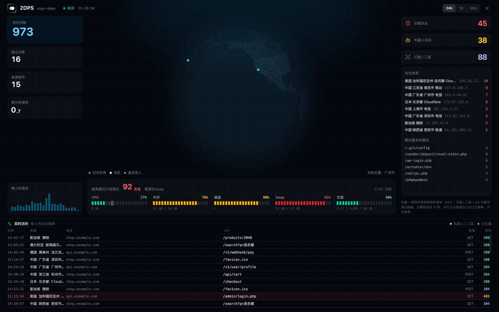
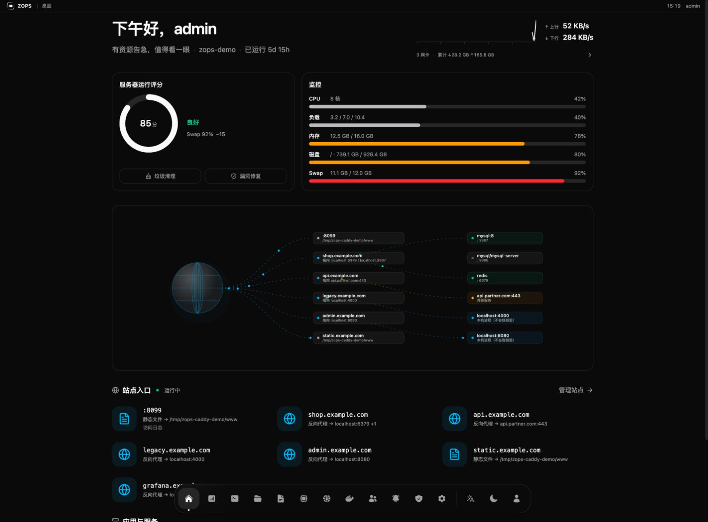
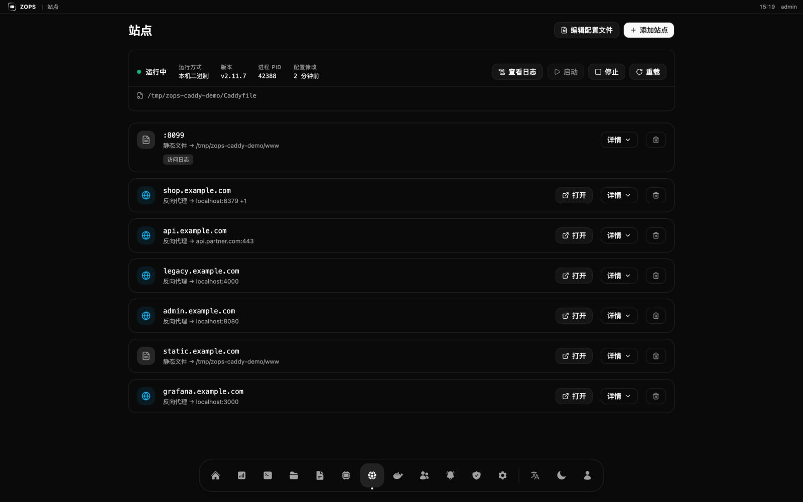
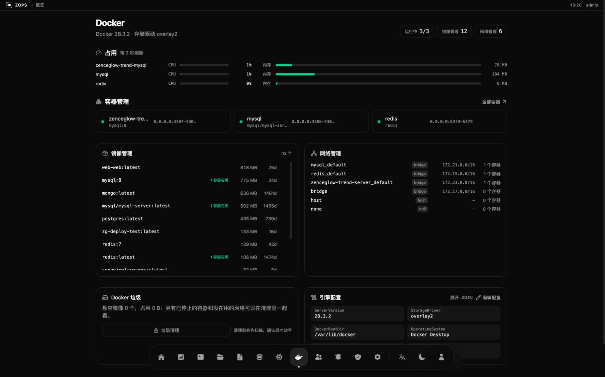
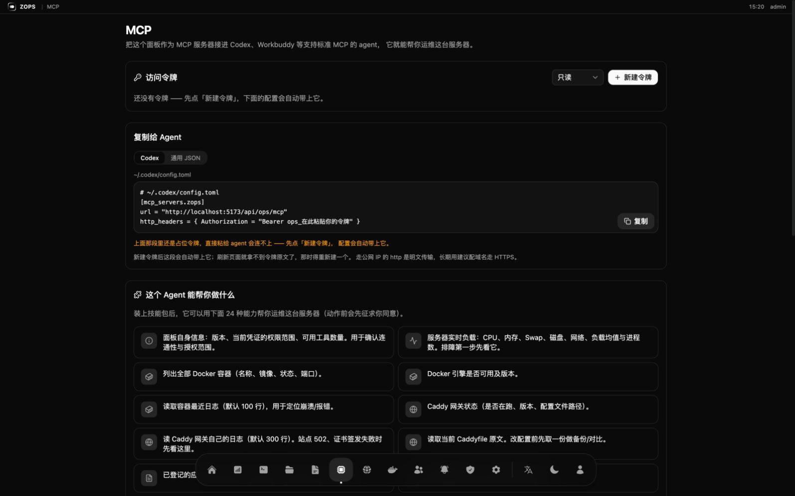

# ZOPS

**一个 AI agent 真的能上手的服务器运维面板。** 一个 Rust 二进制、一个 SQLite
文件，不依赖任何外部服务 —— 单机 Linux 服务器的桌面式控制面板，同时自带
**MCP 服务器**和**技能包**，Codex、Workbuddy 或任何支持 MCP 的 agent 都能在你的
规则下看着、修着这台机器。

**官网：** https://ops.zenceglow.com · **源码：** https://github.com/zenceglow/zops

## 安装

服务器上 root 执行：

```bash
curl -fsSL https://cdn.zenceglow.com/app/ops/install.sh | bash
```

六步短交互，每一步都有默认值 —— 一路回车也能装好：

| 步骤 | 选项 |
|---|---|
| 1. 语言 | English（默认）/ 中文 |
| 2. 检查现有安装 | 自动识别，并告诉你这次是安装还是升级 |
| 3. 端口 | 1) 随机 2) 输入 |
| 4. 域名 | 1) 跳过（用 `IP:端口`）2) 输入（自动写进 Caddy 并重载） |
| 5. 面板用户名 | 1) 随机 2) 输入 |
| 6. 面板密码 | 只有第 5 步输了用户名才问；1) 随机 2) 输入（≥ 6 位） |

脚本会下载二进制、写 systemd 服务、启动面板、建好管理员，然后打印面板地址、
账号密码和 MCP 地址。

**升级就是同一条命令。** 端口、域名、数据目录和账号都不动，先备份数据库再换
二进制。面板自己也能升级：发新版后弹窗里点「立即升级」，下载、校验
（体积 → ELF 魔数 → 真的跑一遍 `--version`）、原子替换、留一份 `.bak`、重启，
全程自动。

非交互安装（CI、批量）用环境变量：

```bash
OPS_LANG=zh OPS_PORT=5200 OPS_DOMAIN=ops.example.com \
OPS_USER=admin OPS_PASSWORD=secret bash install.sh
```

---



*访问统计大屏：由 Caddy 访问日志驱动 —— 请求量、城市、机器人与扫描器、
被拦截的探针，以及实时访问流水。*

## 有什么

|  |  |
|---|---|
|  **首页** —— 问候、运行评分、实时压力，以及把每个域名连到服务它的容器的请求链路图 |  **站点** —— 入口列表与原始 Caddyfile 并存，保存前先校验，历史版本存 SQLite |
|  **Docker** —— 每个容器的占用、镜像大小、网络、垃圾清理，以及可编辑的引擎配置（镜像加速器） |  **MCP** —— 建令牌、把配置复制给 agent，并看清它被允许做什么 |

## 和传统面板有什么不一样

宝塔 / 1Panel / Cockpit 这类面板本质是**给人点的表单**，对 agent 的支持都是后补的。
ZOPS 从另一头设计：面板是**唯一**的入口 —— 你的入口，也是 agent 的入口。
正是这一点，让"让 agent 碰生产服务器"变得可控：

|  | 传统面板 | ZOPS |
|---|---|---|
| 主要使用者 | 点表单的人 | 人 **和** agent |
| Agent 怎么进来 | SSH key / 零散接口 | 标准 MCP 端点 + 可安装的技能包 |
| Agent 自己能看什么 | 什么都不知道 | 24 个有类型的工具（负载、容器、端口、日志、Caddy…） |
| 破坏性操作 | 有 shell 权限就能干 | 工具自带「会改服务器」标记，技能要求先向你确认 |
| 改错配置的爆炸半径 | 说不清 | 站点分块标记；保存前先校验 |
| 审计 | 日志文件 | 谁、从哪来、做了什么、成没成，全进 SQLite |
| 部署一个应用 | 手写 compose | `ops_deploy_plan` → 你确认 → `ops_deploy_apply` |
| 体积 | PHP + nginx + 一堆守护进程 | 15 MB 静态二进制 + SQLite |

## 功能

**首页** —— 运行评分环、CPU / 内存 / 磁盘 / Swap 实时读数，以及从域名到容器的
请求链路图。不是一屏表格。

**服务器** —— 时区、虚拟内存、防火墙，以及会自动识别发行版
（Ubuntu / Debian / CentOS / Rocky…）的补丁管理，待修复的安全更新直接算进运行
评分。垃圾清理先扫描、把扫到的东西摆给你看，确认之后才动手。

**Docker** —— 容器（启停重启删除）、镜像（大小、被谁用着、删除）、网络、垃圾，
以及引擎配置：用表单改 `registry-mirrors` 和 `insecure-registries`，也可以直接
编辑原始 JSON。校验、备份、原子写入，然后重启 Docker。

**Caddy 网关** —— 每个站点写在 `# ZOPS:BEGIN/END` 标记之间，增删改只动一个站点
而不是整个文件；保存前先 `caddy validate`，校验不过不落盘。配置历史存在 SQLite 里。

**还有** —— SSH 终端、应用日志查看器、定时任务、通知渠道
（飞书 / 钉钉 / 企业微信 / Slack / Discord / Telegram / 通用 Webhook）、
带角色权限的成员管理、操作审计、面板内自更新。

## 接入 Agent

打开面板里的 **MCP** 页，建一个令牌（`只读` 或 `读写`），复制配置：

```toml
# ~/.codex/config.toml
[mcp_servers.zops]
url = "https://ops.example.com/api/ops/mcp"
http_headers = { Authorization = "Bearer ops_xxxxxxxx" }
```

同一个页面还会给出把**技能包**装进 agent 技能目录的命令 —— 那是"agent 拿到 24 个
工具"和"agent 知道该怎么用这 24 个工具"之间的差别。

```text
ops_panel_info            ops_system_overview        ops_container_list
ops_container_status      ops_container_logs         ops_container_start
ops_container_stop        ops_container_restart      ops_gateway_status
ops_gateway_logs          ops_gateway_reload         ops_caddyfile_get
ops_caddyfile_put         ops_log_source_list        ops_log_tail
ops_port_list             ops_deploy_list            ops_deploy_plan
ops_deploy_apply          ops_automation_task_list   ops_automation_task_run
ops_member_list           ops_notify_channel_list    ops_notify_send
```

令牌只在创建时显示一次，服务端只存 SHA-256。会改状态的工具都带「会改服务器」
标记，技能里写明调用前要先取得你的同意。

## 把自己开发的应用部署上去

把项目目录丢给 agent，它会：

1. **先看这台机器** —— `ops_port_list` 挑一个没人占的端口，`ops_deploy_list`
   避免重名，而不是猜。
2. **做生产体检** —— 重启策略、日志轮转、时区、网络、明文凭据。缺什么报什么：
   `warn` 还是 `block`。
3. **只在真要紧的时候问你** —— 少一条日志轮转策略是 warn；数据库密码硬编码是 block。
4. **写下来并起起来** —— 生成 compose 文件、跑 `docker compose up -d --build`，
   把端口和地址报给你。

你不用再手写 Docker 配置，而落地的还是你自己会写的那套结构。

## 安全模型

- **只有一个门。** agent 走面板，拿不到宿主机；每次写入都是有类型的工具调用，
  而不是一条任意 shell。
- **权限分档。** `只读` 令牌调不动会改状态的工具，MCP 的 `tools/list` 按权限过滤 ——
  agent 连看都看不到。
- **审计。** 每次写入（人做的、agent 做的）都记下操作者、类型、IP、方法、路径、
  状态码、摘要和脱敏后的请求体。密钥类字段落库前就被抹掉。
- **保存前校验。** Caddy 配置先写到临时文件里 validate，写错的站点不再拖垮整个网关。
- **账号。** Argon2 密码哈希、JWT 会话、基于角色的权限。忘了密码？
  在机器上跑 `zenceglow-ops --reset-password <用户名> <新密码>`。

## 开发

```bash
./dev.sh              # 前端 :5173，后端 :127.0.0.1:5200
cargo test            # 后端测试
cd frontend && npx tsc --noEmit
```

技术栈：Rust（axum + SQLite）、React + Vite + Tailwind，前端用 `rust-embed` 编进
二进制，所以生产环境就**一个文件**。接口的返回结构与路由约定见
[API-CONVENTIONS.md](./API-CONVENTIONS.md)。

## 关键词

AI agent 运维工具 · MCP 服务器 · Codex 技能 · Workbuddy · 服务器运维面板 ·
Docker 管理面板 · Caddy 图形化 · 单机运维首选 · 自托管运维面板 ·
宝塔替代 · 1Panel 替代 · 让 agent 帮你部署应用

## 开源协议

[MIT](./LICENSE) © 2026 Zenceglow（广州境际之光科技有限公司）·
developer@zenceglow.com · https://ops.zenceglow.com
