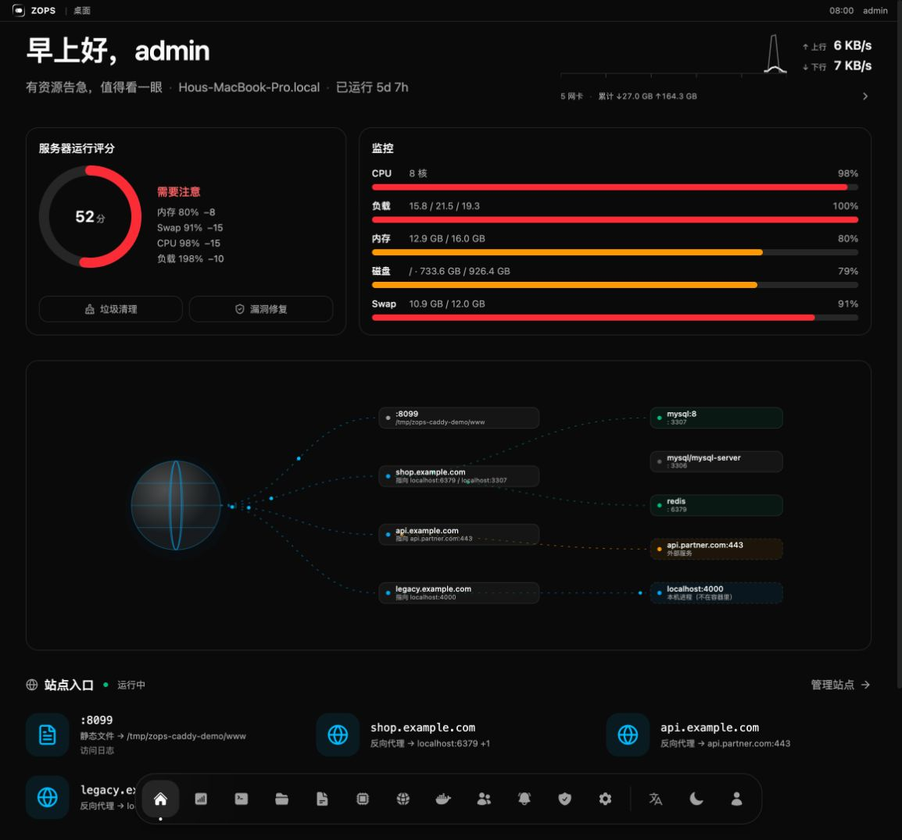
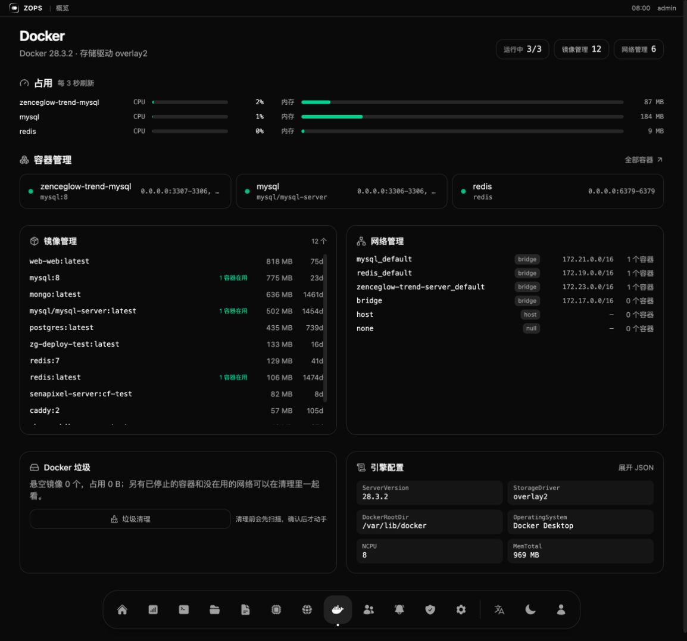
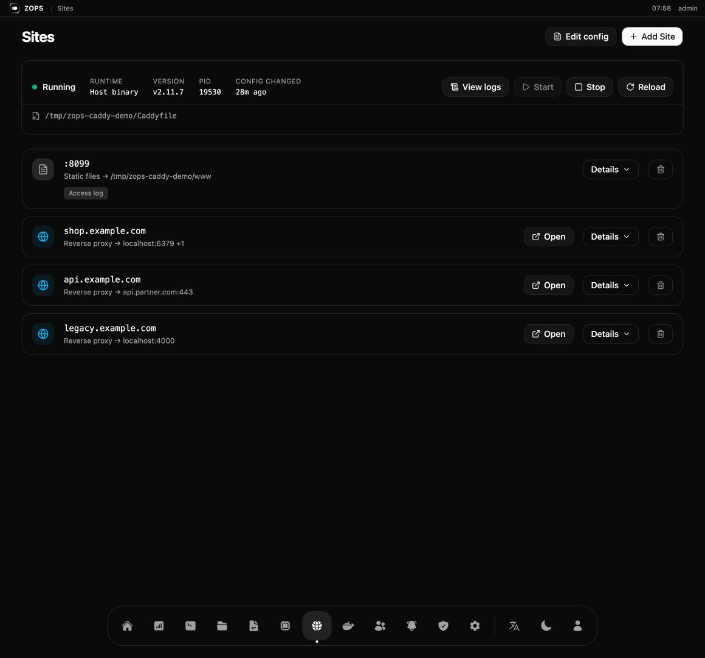
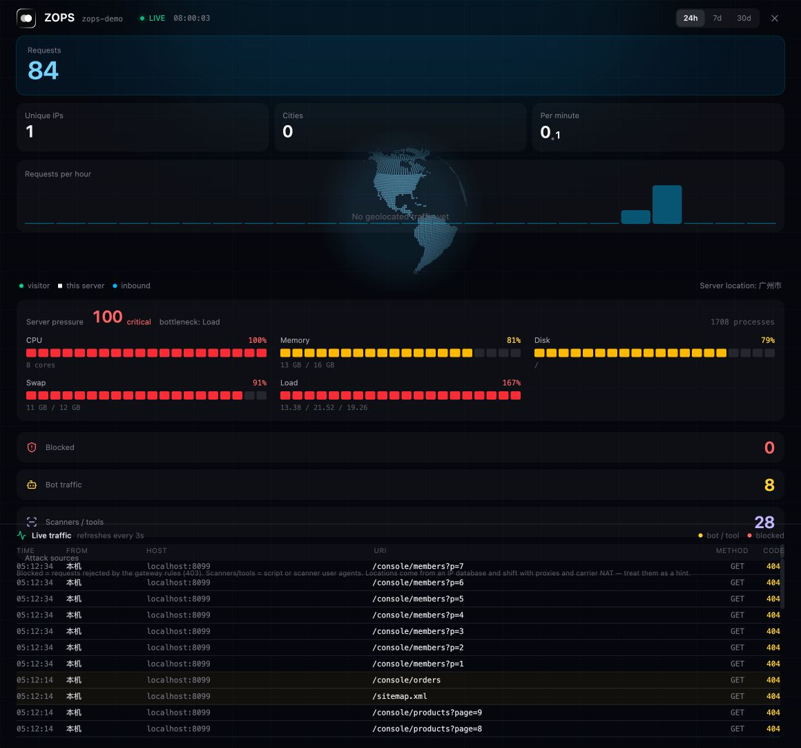
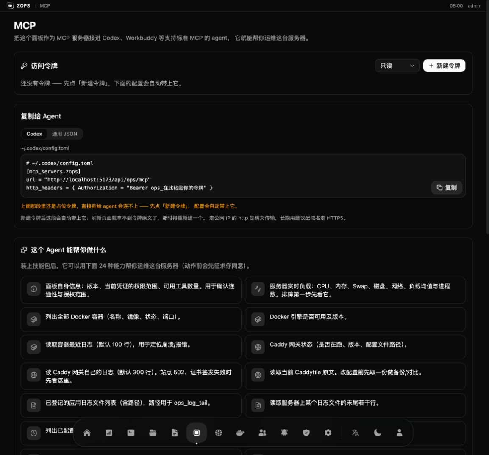
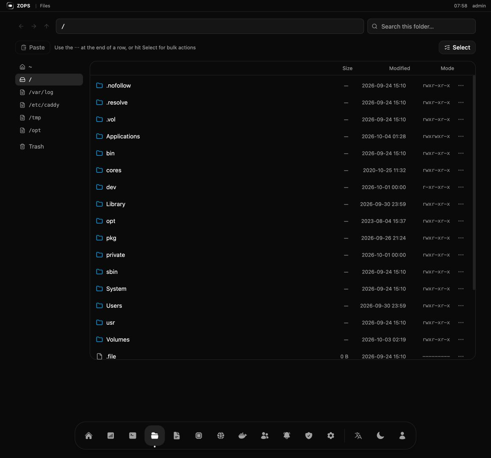
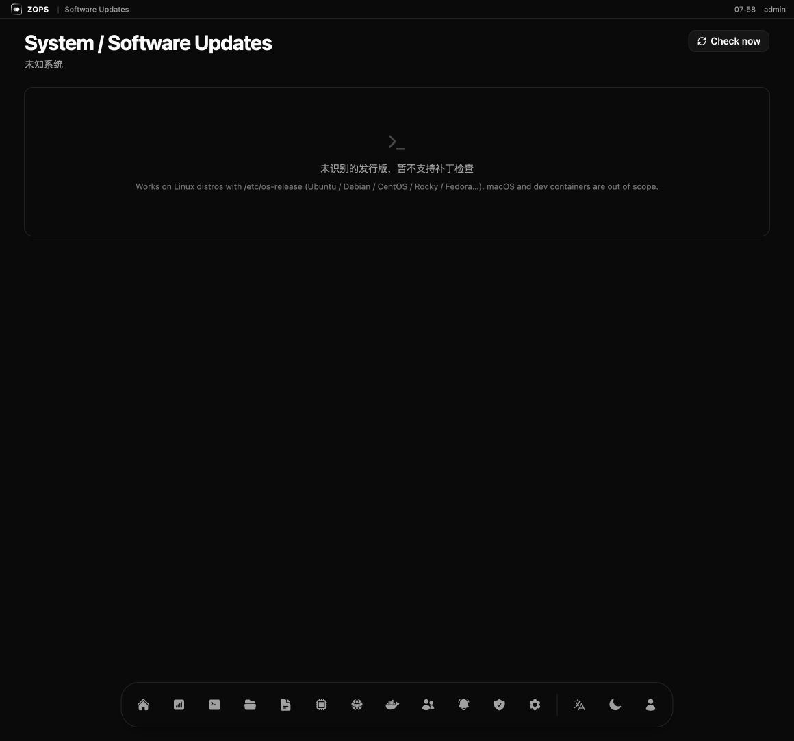
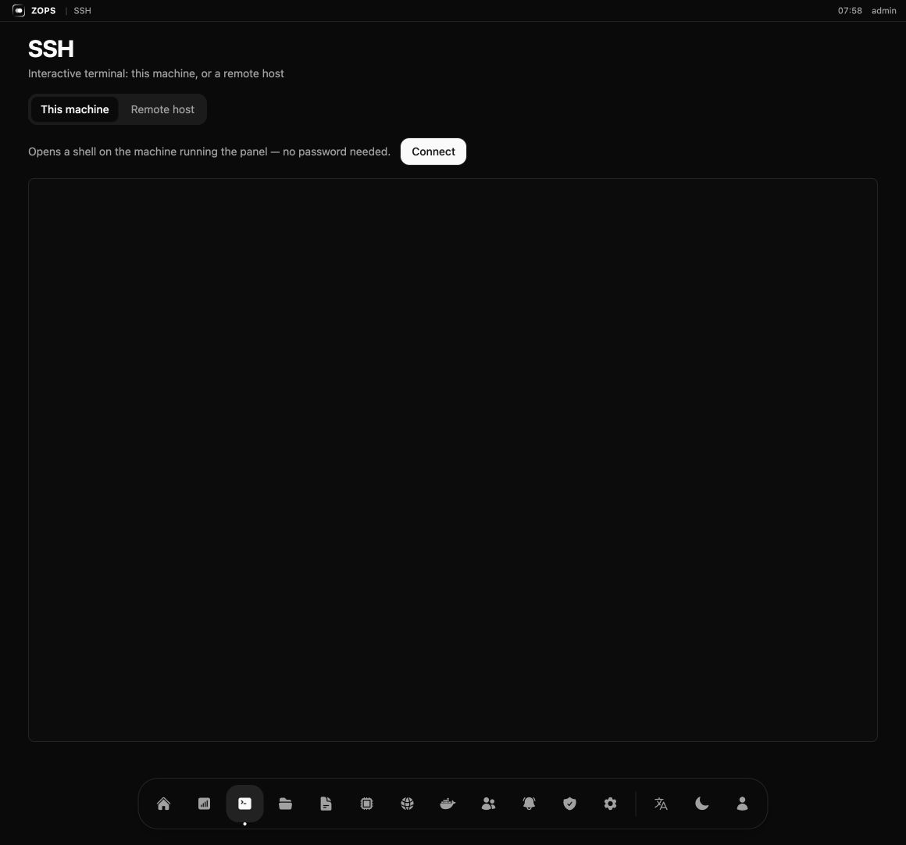

# ZOPS

**一个 AI agent 真的能上手的服务器运维面板。**

一个 Rust 二进制，一个 SQLite 文件，不依赖任何外部服务。ZOPS 是单机 Linux
服务器的桌面式控制面板 —— 同时它本身就是标准的 **MCP 服务器**并自带**技能包**，
所以 Codex、Workbuddy 或任何支持 MCP 的 agent 都能在你的规则下看着、修着这台机器，
而且每一步操作都进审计日志。

[English](./README.md) · [安装](#安装) · [接入-agent](#接入-agent) · [截图](#截图)



---

## 和传统面板有什么不一样

宝塔 / 1Panel / Cockpit 这类面板，本质是**给人点的表单**。对 agent 的支持都是后补的：
留一个 SSH key，或者一个没文档的接口。

ZOPS 从另一头开始设计：面板是**唯一**的入口 —— 你的入口，也是 agent 的入口。
正是这一个决定，让"让 agent 碰生产服务器"这件事变得可控：

|  | 传统面板 | ZOPS |
|---|---|---|
| 主要使用者 | 点表单的人 | 人 **和** agent |
| Agent 怎么进来 | SSH key / 零散接口 | 标准 MCP 端点 + 可安装的技能包 |
| Agent 自己能看什么 | 什么都不知道 | 24 个有类型的工具（负载、容器、端口、日志、Caddy…） |
| 破坏性操作 | 有 shell 权限就能干 | 工具自带"会改服务器"标记，技能要求先向你确认 |
| 改错配置的爆炸半径 | 说不清 | 站点分块标记；保存前先校验 |
| 审计 | 日志文件 | 谁、从哪来、做了什么、成没成，全进 SQLite |
| 部署一个应用 | 手写 compose | `ops_deploy_plan` → 你确认 → `ops_deploy_apply` |
| 体积 | PHP + nginx + 一堆守护进程 | 15 MB 静态二进制 + SQLite |

它就是为**单机**场景做的：一台机器上跑着你的站点、数据库和 Docker 容器。
这恰恰是大多数小团队真实的形态，也恰恰是最难手搓运维的那台机器。

## 有什么

**桌面首页** —— 进来先是一句问候、一个运行评分环和几条实时压力条，而不是一屏表格。
下面那张请求链路图把每个站点入口连到真正在服务它的容器，"这个域名背后是哪个容器"
一眼就能看见，不用敲三条命令。

**服务器** —— CPU / 内存 / Swap / 磁盘 / 网络实时、时区、虚拟内存（swap 文件）管理、
防火墙，以及会自动识别发行版（Ubuntu / Debian / CentOS / Rocky…）的补丁管理，
待修复的安全更新会直接算进运行评分。

**垃圾清理** —— 先扫描（Docker 垃圾、缓存、日志、旧内核），把扫到的东西摆给你看，
确认之后才动手。

**Docker** —— 每个容器的占用、容器列表、镜像（大小、被谁用着、多久前拉的）、网络、
垃圾（悬空镜像 / 已停止容器），以及完整的引擎配置 JSON。

**Caddy 网关** —— 可视化站点管理**和**原始 Caddyfile。生产上最要紧的两件事都做了：
每个站点写在 `# ZOPS:BEGIN/END` 标记之间，增删改只动**一个站点**而不是整个文件；
保存前先用 `caddy validate` 校验，校验不过就不落盘。配置历史存在 SQLite 里，
可以对比、可以回滚。

**访问统计** —— 由 Caddy 访问日志驱动的全屏数据大屏：请求数、独立 IP、城市、
机器人/扫描器流量、被拦截的请求、实时访问流水。用的时候打开，不看时不占用。

**文件管理** —— 类访达的界面，带回收站、多选，支持移动 / 复制 / 粘贴 / 删除。

**还有** —— SSH 终端（本机或远程）、应用日志查看器、定时任务、通知渠道
（飞书 / 钉钉 / 企业微信 / Slack / Discord / Telegram / 通用 Webhook）、
带角色权限的成员管理、操作审计、面板内自更新。

## 安装

服务器上 root 执行一行：

```bash
curl -fsSL https://cdn.zenceglow.com/app/ops/install.sh | bash
```

安装是六步短交互，每一步都有默认值 —— 一路回车也能装好：

| 步骤 | 选项 |
|---|---|
| 1. 语言 | English（默认）/ 中文 |
| 2. 检查现有安装 | 自动识别，并告诉你这次是安装还是升级 |
| 3. 端口 | 1) 随机 2) 输入 |
| 4. 域名 | 1) 跳过（用 `IP:端口`）2) 输入（自动写进 Caddy 并重载） |
| 5. 面板用户名 | 1) 随机 2) 输入 |
| 6. 面板密码 | 只有第 5 步输了用户名才问；1) 随机 2) 输入（≥ 6 位） |

脚本会：下载二进制 → 写 systemd 服务 → 启动 → 用一次性密钥建好管理员 →
打印面板地址、账号密码和 MCP 地址。

**非交互**（CI、批量部署）用环境变量：

```bash
OPS_LANG=zh OPS_PORT=5200 OPS_DOMAIN=ops.example.com \
OPS_USER=admin OPS_PASSWORD=secret bash install.sh
```

**升级就是同一条命令。** 脚本会认出已装的版本，保留端口、域名、数据目录和账号，
先备份数据库，再替换二进制。面板自己也能升级：发新版后界面会弹一个窗口，
点「立即升级」即可 —— 下载、校验（体积 → ELF 魔数 → 真的跑一遍 `--version`）、
原子替换、留一份 `.bak`、重启服务，全程自动。

> 云主机是 NAT，网卡上只有内网 IP。脚本会问外部服务取公网 IP；取不到或想指定，
> 传 `OPS_PUBLIC_HOST=1.2.3.4`。**外网访问记得在云控制台安全组放行端口**，
> 或者配个域名走 443。

## 接入 Agent

这是 ZOPS 和别的面板最不一样的地方。打开面板里的 **MCP** 页：

1. 新建访问令牌 —— `只读`（只能看）或 `读写`（能改东西）。
2. 把生成的配置复制给你的 agent。

```toml
# ~/.codex/config.toml
[mcp_servers.zops]
url = "https://ops.example.com/api/ops/mcp"
http_headers = { Authorization = "Bearer ops_xxxxxxxx" }
```

同一个页面还会给你一段命令，把**技能包**装进 agent 的技能目录。
技能包是"agent 拿到 24 个工具"和"agent 知道该怎么用这 24 个工具"之间的差别 ——
里面写着排障和部署的流程，以及"破坏性动作必须先问用户"这条规矩。

装完直接说话就行：

> 服务器有点卡，你看看怎么回事
>
> 帮我把 Projects/api 这个项目部署上去
>
> 这个域名 502 了，查一下

**24 个工具**，按令牌权限过滤：

```text
ops_panel_info            ops_system_overview        ops_container_list
ops_container_status      ops_container_logs         ops_container_start
ops_container_stop        ops_container_restart      ops_gateway_status
ops_gateway_logs          ops_gateway_reload         ops_caddyfile_get
ops_caddyfile_put         ops_log_source_list        ops_log_tail
ops_port_list             ops_deploy_list            ops_deploy_plan
ops_deploy_apply          ops_automation_task_list   ops_automation_task_run
ops_member_list           ops_notify_channel_list    ops_notify_send
```

令牌只在创建时显示一次，服务端只存 SHA-256。会改变服务器状态的那几个
（`start` / `stop` / `restart` / `reload` / `caddyfile_put` / `task_run` /
`deploy_apply`）在工具描述里都带「会改服务器」的标记，技能里写明调用前要先取得你的同意。

## 把自己开发的应用部署上去

部署技能就是"一个有 shell 的 agent"和"一个按你的习惯部署的 agent"之间的差别。
把项目目录丢给它，它会：

1. **先看这台机器** —— `ops_port_list` 挑一个没人占的端口，`ops_deploy_list`
   避免重名，而不是猜。
2. **做生产体检** —— 重启策略、日志轮转、时区、网络、明文凭据。
   缺什么就报什么：`warn` 还是 `block`。
3. **只在真要紧的时候问你** —— 少一条 logback 轮转策略是 warn，它告诉你然后继续；
   数据库密码硬编码在 env 里是 block。
4. **写下来并起起来** —— 在部署目录生成 compose 文件，跑
   `docker compose up -d --build`，最后把端口和地址报给你。

你不用再手写 Docker 配置，而落地的还是你自己会写的那套结构。

## 截图

| | |
|---|---|
|  **首页** —— 问候、运行评分、实时压力、请求链路 |  **Docker** —— 占用、容器、镜像、网络、垃圾、引擎配置 |
|  **站点** —— 入口卡片、分块标记、保存前校验 |  **访问统计** —— 请求、机器人、拦截、实时流水 |
|  **MCP** —— 令牌、可复制的配置、agent 能做什么 |  **文件** —— 类访达，带回收站 |
|  **漏洞修复** —— 识别发行版，参与运行评分 |  **SSH** —— 浏览器里的终端 |

英文界面：[首页](docs/screenshots/desktop.png) · [Docker](docs/screenshots/docker.png) · [MCP](docs/screenshots/mcp-agent.png)

## 安全模型

- **只有一个门。** agent 走面板，拿不到宿主机；每一次写入都是一个有类型的工具调用，
  而不是一条任意 shell。
- **权限分档。** `只读` 令牌调不动会改状态的工具，MCP 的 `tools/list` 按权限过滤 ——
  agent 连看都看不到。
- **审计。** 每一次写入（人做的、agent 做的）都会记下操作者、类型、IP、方法、路径、
  状态码、摘要和脱敏后的请求体。密钥类字段在落库前就被抹掉。
- **保存前校验。** Caddy 配置先写到临时文件里 `validate`，一个写错的站点不再拖垮
  整个网关；每个站点有独立标记，可以单独改、单独删。
- **账号。** Argon2 密码哈希、JWT 会话、基于角色的权限。忘了密码？
  在机器上跑 `zenceglow-ops --reset-password <用户名> <新密码>`。

## 开发

```bash
./dev.sh              # 前端 :5173，后端 :127.0.0.1:5200
cargo test            # 后端测试
cd frontend && npx tsc --noEmit
```

技术栈：Rust（axum + sqlite）、React + Vite + Tailwind，前端用 `rust-embed`
编进二进制，所以生产环境就**一个文件**。

```
src/
  domain/          纯模型与规则
  service/         用例（容器、网关、部署、统计…）
  infrastructure/  sqlite、docker、caddy、sysinfo、文件系统
  http/            axum handler、中间件（鉴权、审计）、路由
  assets.rs        内嵌前端
frontend/src/
  pages/*/         一页一个目录，页面自己的 API 与 hooks
skills/zops/       agent 技能包（经接口下发）
install.sh         一行安装脚本
deploy.sh          交叉编译并发布到 CDN
```

接口的返回结构与路由约定见 [API-CONVENTIONS.md](./API-CONVENTIONS.md)。

## 关键词

AI agent 运维工具 · MCP 服务器 · Codex 技能 · Workbuddy · 服务器运维面板 ·
Docker 管理面板 · Caddy 图形化 · 单机运维首选 · 自托管运维面板 ·
宝塔替代 · 1Panel 替代 · 让 agent 帮你部署应用 · 带审计的服务器监控

## 开源协议

[MIT](./LICENSE) © 2026 Zenceglow（广州境际之光科技有限公司）

联系邮箱：developer@zenceglow.com
